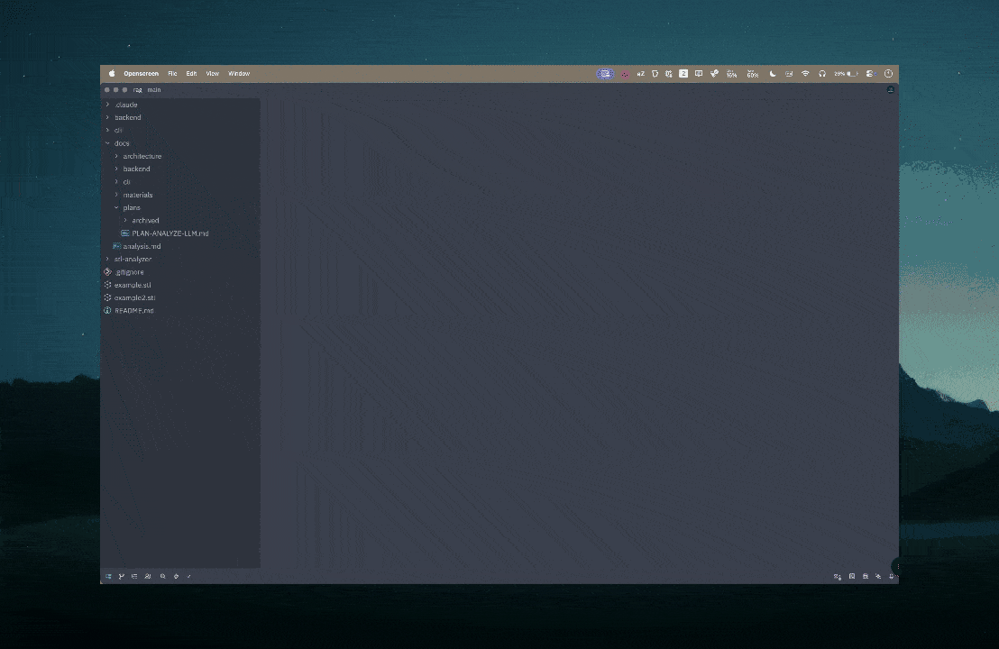

# aZen

A minimal macOS menu bar app for focused work. Set a task, start a timer, and a floating pill keeps it visible at the top of your screen.



## Install

Download the `.dmg` from [Releases](https://github.com/mickyyy68/azen/releases), drag to Applications, then:

```bash
xattr -cr /Applications/aZen.app
```

This is needed because the app is ad-hoc signed (not notarized).

## Usage

- **Global hotkey:** `Cmd+Shift+X` (configurable via "Change Shortcut..." in the menu bar)
- Click the **aZ** icon in the menu bar to open

## Build from source

```bash
./build.sh
# Output: build/aZen.app + build/aZen.dmg
```
